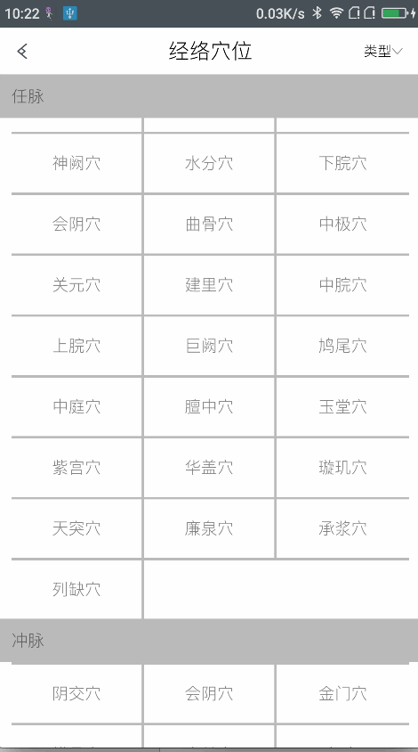
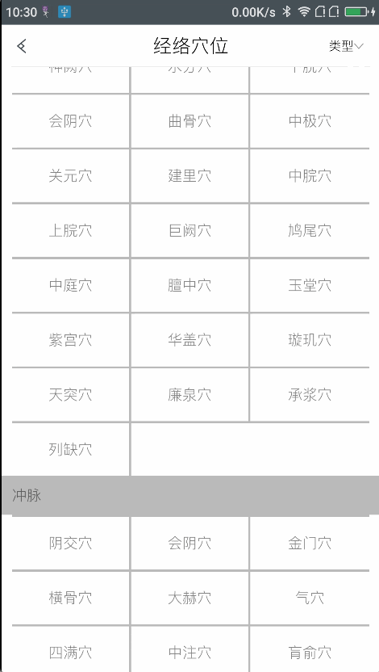

## 效果图

先来看看效果

###### 图1：吸顶效果


<!--more-->


###### 图2：普通效果




## 思路

利用`RecyclerView.ItemDecoration`在`onDrawOver`方法处绘制即可，我们需要一个接口来得到一些数据，比如绘制一个什么样的头部、头部id（一样的头部id表示是一组，这些数据还得紧挨着才行）、item的数量等等

## 步骤

#### 第一步

我们先来实现这个接口

```java
import android.support.v7.widget.RecyclerView;
import android.view.ViewGroup;

public interface SectionRecyclerHeadersAdapter<VH extends RecyclerView.ViewHolder> {
    /**
     * 得到头部id，如果返回的是-1，表示不需要绘制头部
     * @param position
     * @return
     */
    long getHeaderId(int position);

    /**
     * 创建头部布局的viewHolder
     * @param parent
     * @return
     */
    VH onCreateHeaderViewHolder(ViewGroup parent);

    /**
     * 绑定头部布局的viewHolder
     * @param holder
     * @param position
     */
    void onBindHeaderViewHolder(VH holder, int position);
	
    /**
     * 得到item总数
     * @return
     */
    int getItemCount();

    /**
     * 判断该数据是否为null，如果为null，则不绘制其分割线
     * @param position
     * @return
     */
    boolean isNull(int position);
}
```

**注意：如果一组数据不满足整除列数的条件，因为我不知道怎么强制性把下一组数据换行，所以我只能在数据里填null来凑成列数的整数倍。**


------


#### 第二步

我们再来实现一个辅助类，帮助我们缓存头部view

```java
import android.support.v4.util.LongSparseArray;
import android.support.v7.widget.RecyclerView;
import android.view.View;
import android.view.ViewGroup;


/**
 * 缓存头部view
 */
public class HeaderViewCache {

    private final SectionRecyclerHeadersAdapter mAdapter;
    private final LongSparseArray<View> mHeaderViews = new LongSparseArray<>();//缓存头部View

    public HeaderViewCache(SectionRecyclerHeadersAdapter adapter) {
        mAdapter = adapter;
    }

    public View getHeader(RecyclerView parent, int position) {
        long headerId = mAdapter.getHeaderId(position);

        View header = mHeaderViews.get(headerId);
        //判断缓存里是否有
        if (header == null) {
            //TODO - recycle views
            //获取头部View
            RecyclerView.ViewHolder viewHolder = mAdapter.onCreateHeaderViewHolder(parent);
            mAdapter.onBindHeaderViewHolder(viewHolder, position);
            header = viewHolder.itemView;
            //测量view的宽高，相当于onMeasure
            if (header.getLayoutParams() == null) {
                header.setLayoutParams(new ViewGroup.LayoutParams(
                        ViewGroup.LayoutParams.WRAP_CONTENT, ViewGroup.LayoutParams.WRAP_CONTENT));
            }

            int widthSpec;
            int heightSpec;

            widthSpec = View.MeasureSpec.makeMeasureSpec(parent.getWidth(), View.MeasureSpec.EXACTLY);
            heightSpec = View.MeasureSpec.makeMeasureSpec(parent.getHeight(), View.MeasureSpec.UNSPECIFIED);

            //获取view的宽高，可以考虑padding，这里宽度我实现的效果不能考虑padding，如果需要，可以参考高度的实现
            int childWidth = ViewGroup.getChildMeasureSpec(widthSpec,
                    0, header.getLayoutParams().width);
            int childHeight = ViewGroup.getChildMeasureSpec(heightSpec,
                    parent.getPaddingTop() + parent.getPaddingBottom(), header.getLayoutParams().height);
            header.measure(childWidth, childHeight);
            header.layout(0, 0, header.getMeasuredWidth(), header.getMeasuredHeight());
            mHeaderViews.put(headerId, header);
        }
        return header;
    }

    /**
     * 清空缓存，当数据刷新时可以得到更新后的view
     */
    public void invalidate() {
        mHeaderViews.clear();
    }
}
```

因为我要实现的特殊效果，所以我这里没有忽略了RecyclerView的左右padding，如果是普通的RecyclerView的宽度与header的宽度保持一致的话，这里就需要把

```java
  int childWidth = ViewGroup.getChildMeasureSpec(widthSpec,0, header.getLayoutParams().width);
```

改为

```java
int childWidth = ViewGroup.getChildMeasureSpec(widthSpec,parent.getPaddingLeft()+parent.getPaddingRight(), header.getLayoutParams().width);
```


------


#### 第三步

我们可以在继承了`RecyclerView.ItemDecoration`的类里面去绘制header了，在绘制之前我们得先在`getItemOffsets`方法里把header的位置预留出来，如果要绘制分割线，也需要在这里把位置留出来。

```java
@Override
    public void getItemOffsets(Rect outRect, View view, RecyclerView parent, RecyclerView.State state) {
        super.getItemOffsets(outRect, view, parent, state);
        //得到真实的项数
        int itemPosition = parent.getChildAdapterPosition(view);
        if (itemPosition == RecyclerView.NO_POSITION) {
            return;
        }
        //判断是否是各组的第一行，如果是，就设置头部偏移量
        if (isFirstLine(itemPosition)) {
            View header = getHeaderView(parent, itemPosition);
            setItemOffsetsForHeader(outRect, header);
        }
        //为分割线设置偏移量
        int i = itemPosition%count;
        if(i!=count-1){
            outRect.right=mDividerHeight;
            if(adapter.isNull(itemPosition)){
                outRect.right=0;
            }
        }
        outRect.top = outRect.top+mDividerHeight;
    }
```

如果有分割线的话，因为分割线的位置相对是固定的，所以我们可以在`onDraw`里去绘制，如果我们只需要实现普通效果的那种header，其实也可以在这里绘制。

```java
@Override
    public void onDraw(Canvas c, RecyclerView parent, RecyclerView.State state)
    {
        //画分割线
        drawHorizontal(c, parent);
        drawVertical(c, parent);
    }
```

最后就是重点`onDrawOver`了，在这个方法里我们实际上就是绘制header，主要就是计算header的位置。除此之外还有一个地方值得注意，在`RecyclerView.Adapter`的数据刷新时，我们的header也需要刷新，所以我们在构造方法里注册了`RecyclerView.Adapter`的`registerAdapterDataObserver`

```java
//当数据更新时清空缓存的头部view
        ((RecyclerView.Adapter) adapter).registerAdapterDataObserver(new RecyclerView.AdapterDataObserver() {
            @Override
            public void onChanged() {
                headerProvider.invalidate();
            }
        });
```

至于其他的，比如分割线的高度、颜色、哪些地方需要分割线，这些都可以随意。

整个类如下:

```java
import android.graphics.Canvas;
import android.graphics.Paint;
import android.graphics.Rect;
import android.support.v7.widget.RecyclerView;
import android.util.SparseArray;
import android.view.View;

import com.lizardmind.dailyregimen.util.Util;

/**
 * GridLayout 用的粘性头部
 * 注：每一部分数据必须是列数的整倍数
 * Created by Extends on 2017/1/25.
 */
public class SectionDecoration extends RecyclerView.ItemDecoration{
    private static final String TAG="SectionDecoration";

    private HeaderViewCache headerProvider;//头部view缓存
    private final Rect mTempRect = new Rect();//临时Rect
    private SectionRecyclerHeadersAdapter adapter;//头部数据接口
    private final SparseArray<Rect> mHeaderRects = new SparseArray<>();//缓存的头部位置数据
    private boolean isStick = false;//头部view是否悬停
    private Paint mPaint;//分割线画笔
    private int mDividerHeight = 1;//分割线高度，默认为1px

    public SectionDecoration(int count, SectionRecyclerHeadersAdapter adapter){
        this.adapter = adapter;
        headerProvider = new HeaderViewCache(adapter);
        //Recycler列数
        this.count = count;
        mDividerHeight = Util.dip2px(2f);
        mPaint = new Paint(Paint.ANTI_ALIAS_FLAG);
        mPaint.setColor(0xffb1b1b1);
        mPaint.setStyle(Paint.Style.FILL);
        //当数据更新时清空缓存的头部view
        ((RecyclerView.Adapter) adapter).registerAdapterDataObserver(new RecyclerView.AdapterDataObserver() {
            @Override
            public void onChanged() {
                headerProvider.invalidate();
            }
        });
    }

    @Override
    public void getItemOffsets(Rect outRect, View view, RecyclerView parent, RecyclerView.State state) {
        super.getItemOffsets(outRect, view, parent, state);
        //得到真实的项数
        int itemPosition = parent.getChildAdapterPosition(view);
        if (itemPosition == RecyclerView.NO_POSITION) {
            return;
        }
        //判断是否是各组的第一行，如果是，就设置头部偏移量
        if (isFirstLine(itemPosition)) {
            View header = getHeaderView(parent, itemPosition);
            setItemOffsetsForHeader(outRect, header);
        }
        //为分割线设置偏移量
        int i = itemPosition%count;
        if(i!=count-1){
            outRect.right=mDividerHeight;
            if(adapter.isNull(itemPosition)){
                outRect.right=0;
            }
        }
        outRect.top = outRect.top+mDividerHeight;
    }

    @Override
    public void onDraw(Canvas c, RecyclerView parent, RecyclerView.State state)
    {
        //画分割线
        drawHorizontal(c, parent);
        drawVertical(c, parent);
    }

    public void drawHorizontal(Canvas c, RecyclerView parent)
    {
        int childCount = parent.getChildCount();
        for (int i = 0; i < childCount; i++)
        {
            final View child = parent.getChildAt(i);
            if (mPaint != null) {
                c.drawRect(child.getLeft(), child.getTop()-mDividerHeight, i%count==count-1?child.getRight():child.getRight()+mDividerHeight, child.getTop(), mPaint);
            }
        }
    }

    public void drawVertical(Canvas c, RecyclerView parent)
    {
        final int childCount = parent.getChildCount();
        for (int i = 0; i < childCount; i++)
        {
            final View child = parent.getChildAt(i);

            if (mPaint != null&&i%count!=count-1) {
                c.drawRect(child.getRight(), child.getTop(),child.getRight()+mDividerHeight, child.getBottom()+mDividerHeight, mPaint);
            }
        }
    }

    /**
     * 设置来自于header的偏移量
     *
     * @param itemOffsets 
     * @param header 
     */
    private void setItemOffsetsForHeader(Rect itemOffsets, View header) {
        itemOffsets.top = header.getHeight() + mTempRect.top + mTempRect.bottom;
    }

    private boolean isFirstLine(int pos){
        if(isFirstInGroup(pos)){
            return true;
        }else{
            if(pos-count<0){
                return true;
            }
            if (adapter.getHeaderId(pos - count)==adapter.getHeaderId(pos)) {
                return false;
            } else {
                return true;
            }
        }
    }

    int count  = -1;

    @Override
    public void onDrawOver(Canvas c, RecyclerView parent, RecyclerView.State state) {
        super.onDrawOver(c, parent, state);
        //得到左右边距的位置信息
        int left = 0;
        int right = parent.getWidth();//如果要考虑padding，则应减去左右padding
        int headHeight = 0;
        final int childCount = parent.getChildCount();//缓存的数量，与数据项数不一样
        if (childCount <= 0 || adapter.getItemCount() <= 0) {
            return;
        }
        long preGroupId = -1;
        long groupId = -1;

        for (int i = 0; i < childCount; i++) {
            View itemView = parent.getChildAt(i);
            int position = parent.getChildAdapterPosition(itemView);
            if (position == RecyclerView.NO_POSITION) {
                continue;
            }
            //只有各组第一个 并且 groupId!=-1 才绘制头部view
            preGroupId = groupId;
            groupId = adapter.getHeaderId(position);
            if(groupId==-1||groupId==preGroupId)continue;

            View header = headerProvider.getHeader(parent, position);
            //获取缓存的头部view的位置信息，如果没有则新创建
            Rect headerOffset = mHeaderRects.get(position);
            if (headerOffset == null) {
                headerOffset = new Rect();
                mHeaderRects.put(position, headerOffset);
            }
            //获取头部view的top、bottom位置信息
            float textY = itemView.getTop();
            headHeight = header.getHeight()+mDividerHeight;
            if(isStick){
                textY = Math.max(headHeight,itemView.getTop());
                int nextPosition = getNextGroupId(i,(int)groupId,childCount,parent);
                if(nextPosition!=-1){
                    View itemView1 = parent.getChildAt(nextPosition);
                    //判断下一个头部view是否到了与上一个头部view接触的临界值
                    //如果满足条件则把上一个头部view推上去
                    if(itemView1.getTop()<=headHeight+header.getHeight()){
                        textY=itemView1.getTop()-header.getHeight();
                    }
                }
            }
            //绘制头部view
            headerOffset.set(left, (int)textY - headHeight, right, (int)textY);
            drawHeader(c, header, headerOffset);
        }
    }

    /**
     * 获取下一个节点，如果没有则返回-1
     * @param count
     * @return
     */
    private int getNextGroupId(int id,int groupId,int count,RecyclerView parent){
        for (int i = id; i < count; i++) {
      	if(adapter.getHeaderId(parent.getChildAdapterPosition(parent.getChildAt(i)))!=groupId){
                return i;
            }
        }
        return -1;
    }

    public void drawHeader( Canvas canvas, View header, Rect offset) {
        canvas.save();
        //把(offset.left, offset.top)点设为原点
        canvas.translate(offset.left, offset.top);
        header.draw(canvas);
        canvas.restore();
    }


    /**
     * 判断是不是组中的第一个位置
     *
     * @param pos
     * @return
     */
    private boolean isFirstInGroup(int pos) {
        if (pos == 0) {
            return true;
        } else {
            //判断前一个字符串 与 当前字符串 是否相同
            if (adapter.getHeaderId(pos-1)==adapter.getHeaderId(pos)) {
                return false;
            } else {
                return true;
            }
        }
    }

    /**
     * 获取HeaderView
     * @param parent
     * @param position
     * @return Header view
     */
    public View getHeaderView(RecyclerView parent, int position) {
        return headerProvider.getHeader(parent, position);
    }
}
```


## 使用

使用方法很简单，只需要实现`SectionRecyclerHeadersAdapter`接口就可以了

```java
public class TestAdapter  extends RecyclerView.Adapter<TestAdapter.ViewHodler>
        implements SectionRecyclerHeadersAdapter<TestAdapter.HeadViewHodler> {
    private List<String[]> list;//假设数组的第一个元素是headerid，第二个元素是要显示的值
    public TestAdapter (List<String[]> list){
        this.list = list;
    }

    @Override
    public ViewHodler onCreateViewHolder(ViewGroup parent, int viewType) {
        return new ViewHodler(LayoutInflater.from(parent.getContext()).inflate(R.layout.item_meridian_point, parent, false));
    }

    @Override
    public void onBindViewHolder(ViewHodler holder, int position) {

    }

    @Override
    public long getHeaderId(int position) {
        for (int i = position; i >=0; i--) {
            if(list.get(i)!=null){
                return Integer.parseInt(list.get(i)[0]);
            }
        }
        return -1;
    }

    @Override
    public HeadViewHodler onCreateHeaderViewHolder(ViewGroup parent) {
        return new HeadViewHodler(LayoutInflater.from(parent.getContext()).inflate(R.layout.head_meridian_point, parent, false));
    }

    @Override
    public void onBindHeaderViewHolder(HeadViewHodler holder, int position) {

    }

    @Override
    public int getItemCount() {
        return list.size();
    }

    @Override
    public boolean isNull(int position) {
        return list.get(position)==null;
    }

    public class ViewHodler extends RecyclerView.ViewHolder {
        public ViewHodler(View itemView) {
            super(itemView);
        }
    }

    public class HeadViewHodler extends RecyclerView.ViewHolder {
        public HeadViewHodler(View itemView) {
            super(itemView);
        }
    }
}
```


## 有问题反馈

在使用中有任何问题，欢迎反馈给我，可以用以下联系方式跟我交流

* Email: 2563892038@qq.com
* Github: [LiXiaoGuo](https://github.com/LiXiaoGuo)